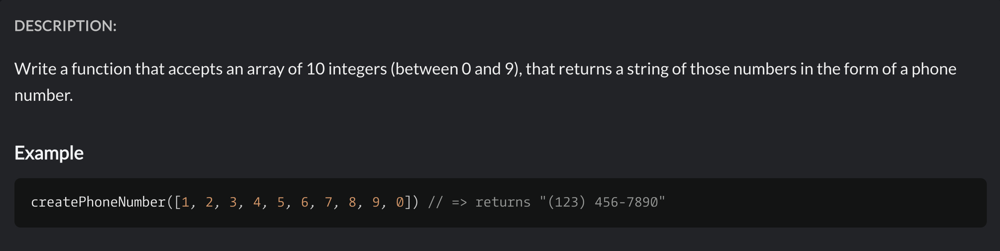

# Jaroslav Makeichyk

### _Junior Front-end developer_

---

> **Location:** Lublin, Poland  
> **Email:** makeichyk.jaroslav@gmail.com | **Phone:** +48 517424391 (PL)  
> **Links:** [**GitHub**](https://github.com/Makeichyk) | [**LinkedIn**](https://www.linkedin.com/in/jaroslav-makeichyk-8b8260234/) | [**Telegram**](https://t.me/Jaroslav_Makeichik) >

## Summary

##### _Entry-level Frontend Developer with a solid foundation in HTML, CSS, and JavaScript, currently focusing on React and TypeScript. Actively seeking an internship or junior role to gain hands-on experience in real-world development. Particularly motivated by the opportunity to work on meaningful projects that deliver real value to users. Interested in team collaboration, knowledge sharing, and continuous growth as a developer._

## Technical Skills

**Languages:** _JavaScript , HTML, CSS, TypeScript,_  
**Frameworks/Libraries:** _Currently learning React_  
**Tools & Technologies:** _Git, Figma, Webpack, ESLint, Prettier_  
**Methodologies & Practices:** _BEM, REST API, Agile, Scrum_  
**Backend Exposure:** _Used MAMP for simulating server interactions during training_

## Projects

### [Grocery Store Website](https://makeichyk.github.io/food_shop/)

_Developed a responsive online grocery store as part of training. Implemented semantic HTML and CSS for layout, and added interactive elements using JavaScript._

### [Animal Shelter Website](https://makeichyk.github.io/Shelter/pages/main/index.html)

_Created a multi-page site for an animal shelter, focusing on clean structure (BEM methodology), adaptive design, and basic accessibility._

### [Virtual Keyboard Simulator](https://makeichyk.github.io/Virtual-Keyboard/)

_Built a web application that simulates keyboard typing on-screen. One of the most challenging parts was handling the Shift key logic: when Shift was pressed, all subsequent on-screen key presses output uppercase letters until released._

## CODE EXAMPLE



#### _My JavaScript Solution_

```
function createPhoneNumber(numbers){
  let res = "(***) ***-****";
  for (let i = 0; i < numbers.length; i++){
    res = res.replace("*",numbers[i]);
  }
  return res
}
```

## Education

### **Belarus State Economic University (BSEU)**

_Incomplete Studied Finance and Banking. Left to pursue a career in IT._

### **Rolling Scopes School**

#### Frontend Development (Stage 1 completed)

_Intensive program focused on HTML, CSS, JavaScript, and basic frontend architecture_

### Udemy

#### JavaScript Development Course

_Completed an online course covering core JavaScript concepts and browser APIs._

### W3Schools & Basic JS Practice

_Self-paced learning and hands-on practice with JavaScript basics and web standards._

## English Language Skills

#### Level: B1+ (Intermediate) according to EFSet test.

Regular communication with native speakers and comfortable consumption of technical and business information in English. Recently worked with English leasing contracts, gaining experience in professional documentation.
